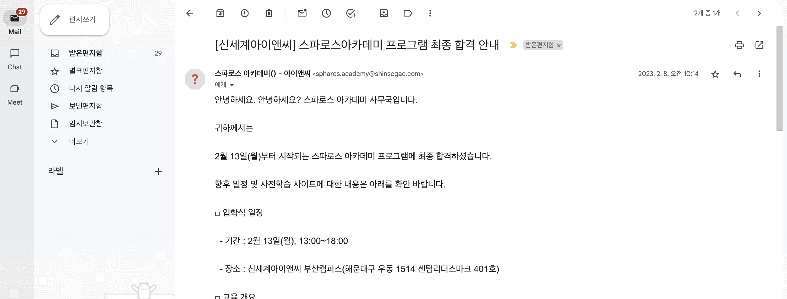

### 1. 배경
---
스파로스아카데미는 [신세계아이앤씨](https://shinsegae-inc.com/main.do)에서 주관하는 부산 지역 청년 대상 sw 교육프로그램입니다.  

저는 학교 동아리에서 웹개발 프로젝트를 진행해본 경험이 있었습니다. 하지만 동아리분들이 너무 똑똑해서(?) 이미 많은 것들이 개발된 상태였고,
`A부터 Z`까지 `웹개발`의 모든 것을 경험해보고픈 갈증이 있었습니다.

 
 

### 2. 선정 이유
---
사실, 요즘 다양한 소프트웨어 교육 프로그램들이 즐비해있습니다.  
구글에 sw교육프로그램 관련해서 조금만 검색하더라도 많은 교육프로그램들을 찾을 수 있었습니다.    
(심지어, 나의 검색어를 기반으로 인스타에서도 계속 광고를...)  

당시의 저는 웹개발을 위한 공부를 어느 정도 진행하고 있었던 상태였기에 프로그래밍 언어부터 교육하는 곳은 적합하지 않다고 생각했습니다.
국비교육은 대체로 기초 언어 수업부터 진행했기에 배제를 하였고, 기업에서 주관하며 프로젝트의 질이 조금 더 높은 sw교육프로그램을 찾았습니다.

1. SSAFY(싸피)
2. SPHAROS ACADEMY(스파로스아카데미)

위처럼 부산에서하는 기업 주관 sw교육프로그램을 찾을 수 있었습니다.  
저는 2학기에 대학교에 복학을 해야하는 슬픈 소명이 있었기에 1년과정인 싸피보다 4개월 진행과정인 스파로스아카데미에 도전하기로 마음을 먹게되었습니다.👊 스파로스아카데미도 신세계아이앤씨라는 대기업에서 주관하는 교육이었기에 신뢰를 할 수 있었습니다.  
무엇보다도 프로젝트 중심의 교육과정이 너무나 마음에 들었습니다!

이제 합격만하면 되는데...

 
 

### 3. 지원 절차
---
1. 지원서류
2. 코딩테스트
3. 면접/인터뷰

위의 3가지 절차를 진행하였습니다.  
`지원서류`는 인적사항과 지원동기 300자로 구성되어있습니다. 지원동기는 정말 진솔하게 지원한 동기 + 제가 그동한 배운것들과 그곳에서 프로젝트를 진행하며 더 발전시키고 싶은 것들을 적었습니다.    
`코딩테스트`는 백준 기준으로 실버 2 ~ 3 수준으로 출제된 듯 하였습니다. 백준 골드에 주차하신분들은 무난하게 푸실 것 같습니다.  
`면접/인터뷰`는 지원동기에서 제가 사전에 진행했던 프로젝트에 대해서 질문하였습니다. 편안한 분위기의 면접이었고, 면접관님들 인상 또한 너무 좋았던 것 같습니다.  

 
 

### 4. 합격
---
합격은 문자와 이메일을 통해서 확인할 수 있었습니다.  

[합격 이메일]

 
 

### 5. 여담
---
스파로스아카데미는 부산 센텀에 위치해 있는데, 대기업에서 주관해서 그런지 시설이 쾌적했습니다.   
깨끗한 시설이 마치 스타트업 개발자가 된 것 같은 좋은 기분을 주었습니다 ?(물론, 된적 없음)

더 자세한 내용은 수료 후기에 남기도록 하겠습니다.😃

