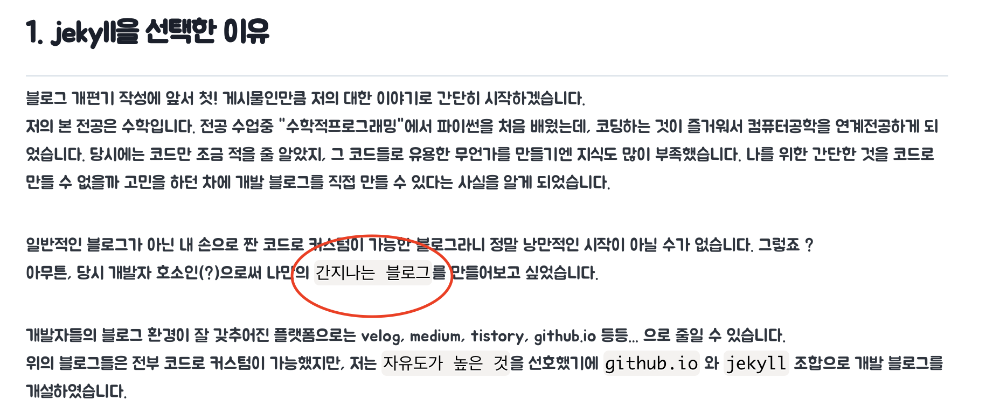
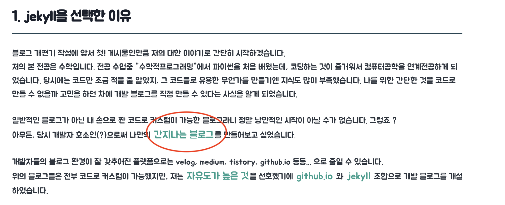
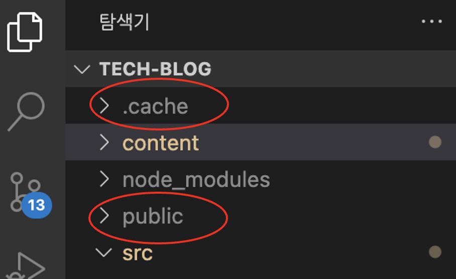

### 1. 상황
---
저의 블로그는`Gatsby`라는 정적 웹 생성기로 개발하여, `Netlify`를 사용해서 배포를 하고있습니다. 조금 더 나의 블로그 분위기에 맞는 포스트를 위해서 markdown 파일에 css를 입혀주고 있었습니다. 뚝딱 뚝딱 이색 저색 비교해가면서 열심히 만들고 local 환경에서 확인 후 배포를 진행하였습니다.

[before]

[after]

다음과 같이 markdown css를 다양하게 바꿔주었습니다.  
local 환경에서 개발을하며 원하는 형태로 갖춰져 가는 모습을 보며 희열을 느꼈습니다. 그리고는 배포를 완료하고 두근두근한 마음으로 게시물에 접속했는데,
뜨거운 가슴은 차갑게 식고 말았습니다.  

`배포 후`에도 `이전의 CSS`가 그대로 적용이라도 된듯이 [before]의 모습으로 저를 기다리고 있었습니다.

### 2. 분석
---
배포 후 `스테이지` 환경이 `없어서` 사실 다음과 같은 로컬에서 잘 동작하던 것(코드 이외의 문제)이 배포 환경에서 제대로 동작하지 않으니 버그를 잡는 것이 쉽지 않은 상황이었습니다. 해결은 해야하니 정신을 바짝 차리고 차분히 분석을 시작했습니다.
개발자모드(F12)를 눌러서 확인해보니 이전의 CSS 파일이 적용되고 있었습니다.  
여러가지 추측들을 하였는데 아래와 같습니다.

> 1. 배포 과정 중 충돌, 누락이 되었을 수도 있으니 재배포를 해보자. -> 실패
> 2. 브라우저에 캐싱된 과거의 css 파일을 가져오고 있을 수 있으니 브라우저 캐시를 모두 삭제해보자. -> 실패

과거의 css 파일이 그대로 적용되고 있으니, 무조건 위의 2문제를 해결한다면 올바르게 적용이 될 것이라고 생각했습니다.  
하지만 둘다 실패를 하였습니다.  
저의 블로그를 한번 도 접근한 적 없는 PC에서 해당 게시물을 방문하였을 때도 과거의 CSS 파일에 접근을 하고 있었고, 2번 케이스는 완벽히 배제를 하고 1번 상황에 대해서 더 자세히 고민을 해보았습니다.

### 3. 해결
---
역시 문제는 `1번` 케이스에 있었습니다.  
정확히는 배포하는 과정 중에 CSS 파일 문제가 발생한 것은 아니지만, 배포 전 캐시 데이터를 이용한 것으로 원인을 추정해볼 수 있었습니다.
local 개발하는 환경에 ./public 폴더 안에 있던 이전의 CSS가 그대로 배포되고 있는 상황이었습니다.  
그래서 `./cache`와 `./public` `폴더`를 `삭제`한 후 다시 재배포를 하니 CSS가 적용되기 시작하였습니다.   
다시 재배포 후에도 `브라우저 캐시`를 `다시 한번` 더 지워줘야 깔끔히 적용되는 모습을 볼 수 있었습니다.

[디렉터리 구조]

열심히 개발한 CSS가 적용이 안되니 정말로 답답한 상황이었습니다.🥲  
그래도 캐시만 지워주면 해결되는 문제여서 정말 다행이었습니다.  

저와 같은 문제를 겪는 분이 있다면 꼭 브라우저 및 public 파일에 있는 캐시 파일을 의심해보시길 바랍니다.