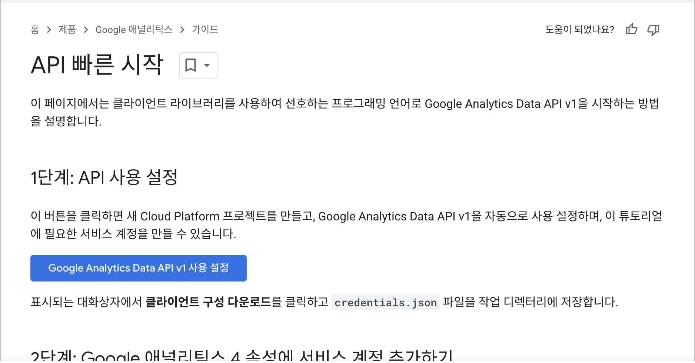
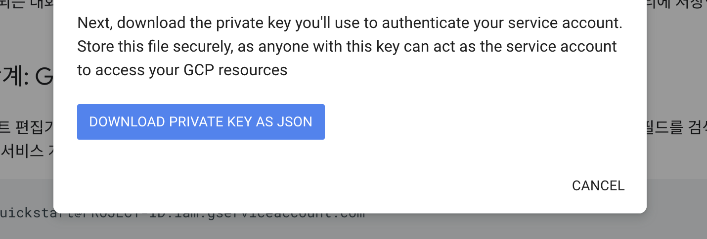
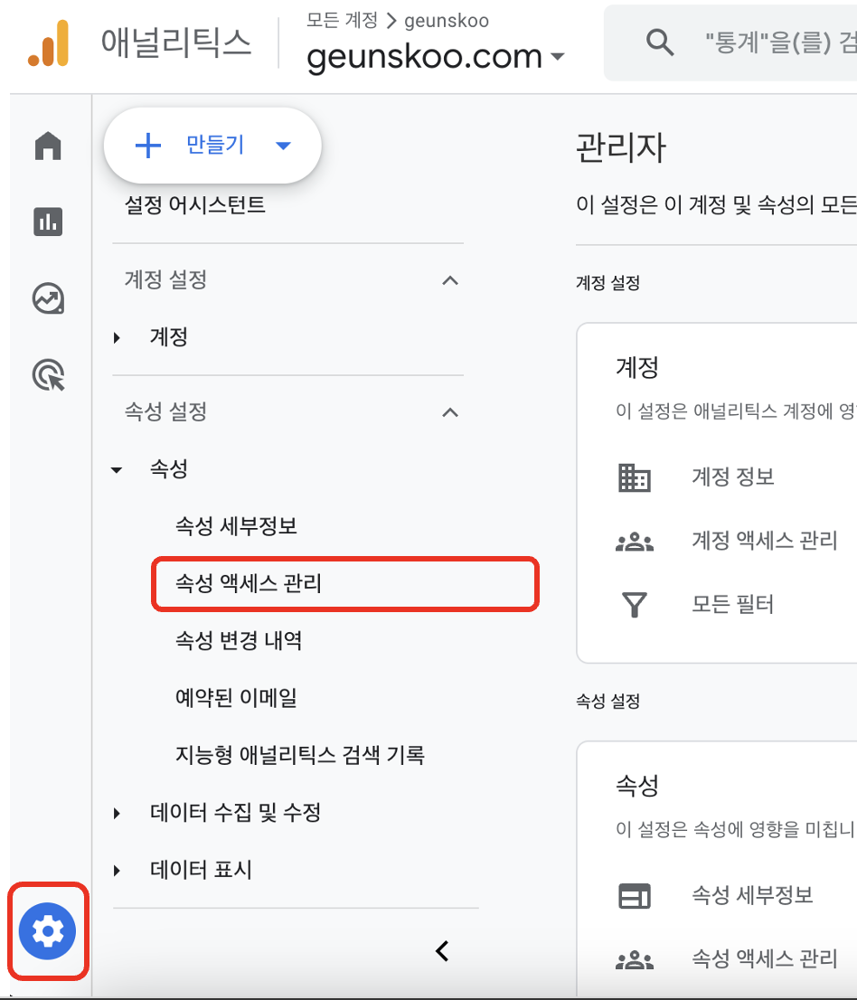
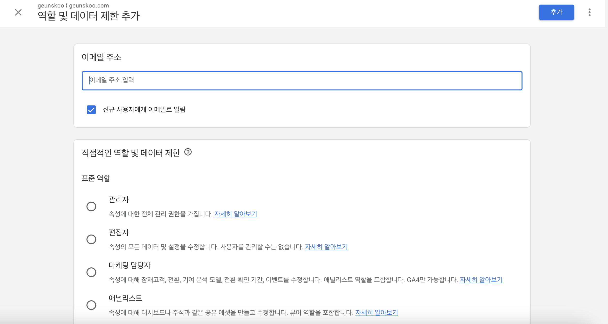
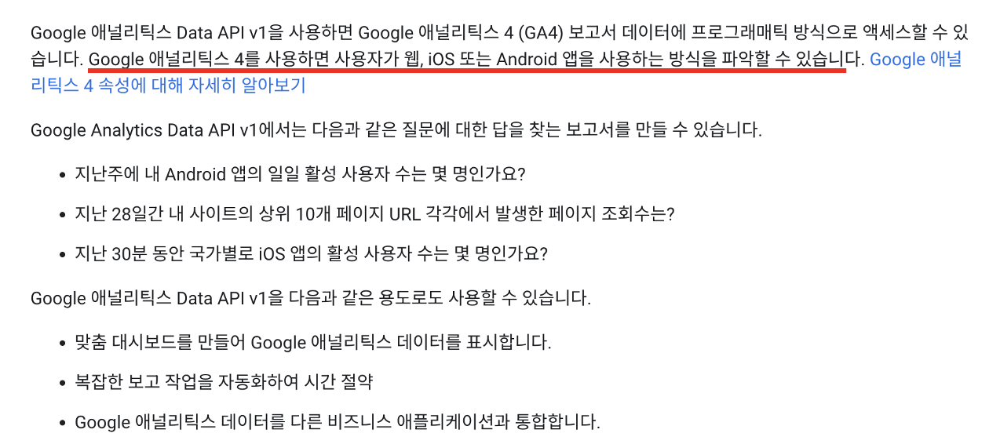
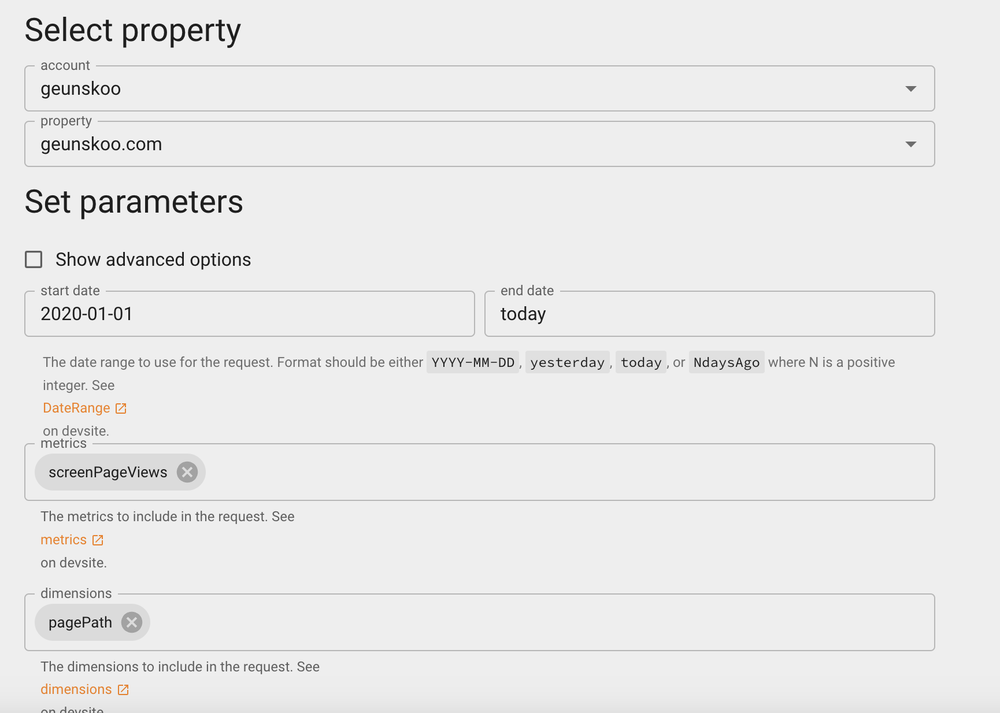
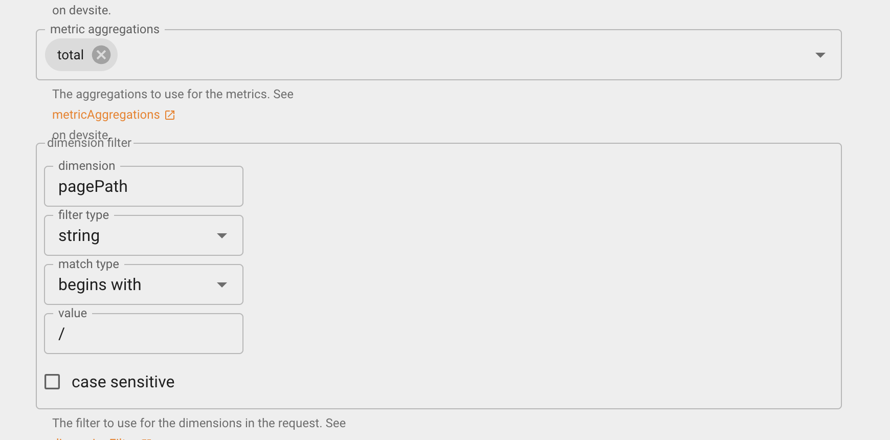
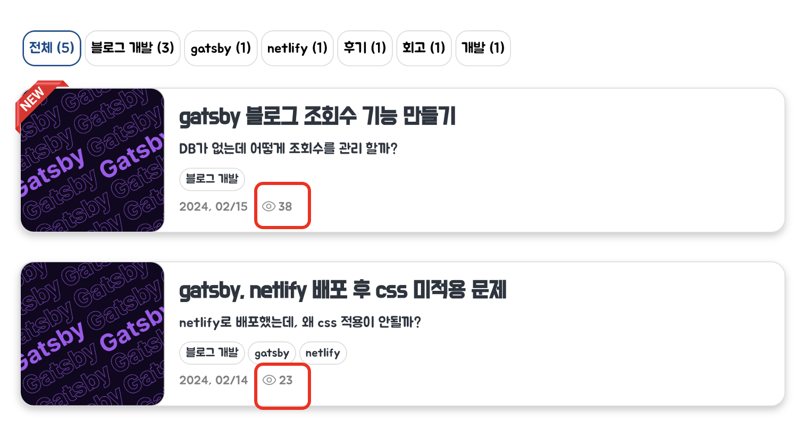

### 1. 상황
---
Gatsby는 정적 웹 생성기로 서버에서 정적인 HTML 파일을 보여줍니다.  
따라서, 클라이언트에서 발생하는 이벤트를 영구적으로 저장하는 것에 어려움이 있습니다.(서버리스느낌으로 만들거야 하더라도 DB가 없습니다.)
그렇다면 조회수(클라이언트에서 보내는 이벤트를 반 영구적으로 저장 해야함) 구현이 불가능 하는 것 일까요?  
그렇지 않습니다.
세상은 넓고 똑똑한 사람은 역시나 많습니다.

단순하게 상황만 놓고 고려해본다면,  
아래와 같은 방식들을 생각해 볼 수 있습니다.
> 1. 로컬스토리지, 세션, 쿠키를 이용한다.
> 2. 외부의 데이터베이스를 구축한다.
> 3. 외부 서비스를 이용한다.
사실,  
`1번`의 방법은 영구적인 저장이 불가능하기에 패스, 결국에는 나의 조회수 데이터를 영구적으로 저장할 외부의 DB가 구축되어 있어야합니다.  
`2번`의 방법은 비용의 문제와 연결이 됩니다. gatsby, netlify와 같이 블로그와 같은 작은 크기의 서버를 무료로 호스팅 해주는 곳은 많지만 DB서버 및 백엔드 서버를 무료로 이용할 수 있는 곳은 찾기가 힘듭니다. 귀여운 지갑 사정으로 포기!  
`3번`의 방법이 정적 웹 호스팅기에서 할 수 있는 최적은 방법 같습니다. 구글에 조금만 검색해보더라도 3번의 사례들을 여러 건 찾아 볼 수 있었습니다.

저는 3번의 방법으로 조회수 기능을 구현하였습니다.

### 2. <span style="color: #289e8e"> 외부의 서비스</span> 선정
---
외부 서비스를 이용하는 방법으로는 아래와 같은 방법을 찾을 수 있었습니다.
> 1. busuanzi API 이용하기
> 2. google analytics API 이용하기

`1번`의 방법은 조회수를 적용하는 방식이 매우 간단했습니다. 하지만 조회수를 추적하는 방식이 개인적으로는 불투명하고, 중국어로 되어있는 DOCS를 읽으며 유지보수를 할 자신이 없었기에 패스했습니다.(개발자가 중국인이라고 합니다.)  
하지만, 적용 방식이 정말 간단하기에 빠르게 조회수를 적용하고 싶은 분들에게는 방법될 듯 합니다.
[busuanzi 참고](https://busuanzi.ibruce.info/) 한국어 번역기 사용 추천

`2번`의 방법은 비교적 신뢰성이 높은 구글 애널리틱스에서 제공하는 API를 이용하는 방법입니다. 조회수의 실시간 업데이트는 포기해야하지만 높은 신뢰성을 얻을 수 있습니다. 다만 적용방법이 저에게는 다소 까다로웠습니다.

저는 2번의 구글 애널리틱스를 이용하여 조회수를 구현하였습니다. 

### 3.<span style="color: #289e8e"> 구글 애널리틱스</span>를 이용하여 조회수 구현
---
외부서비스의 API를 사용하려면 대부분의 인증 위한 토큰 발행 절차 혹은 request 도메인 주소 설정이 있습니다.  
간단한 설정이 토큰을 내 프로젝트에서 api를 던질때마다 사용할 수 있도록 환경변수로 등록해두어야합니다.
마지막으로는 구글 애널리스틱스에서 어느 타이밍에 조회수를 끌어와서 화면에 보일지를 고민하면 됩니다.

절차를 정리하면 아래와 같습니다.

> 1. 내 구글 애널리틱스에 접근할때 사용할 인증토큰(credentials.json) 발행.
> 2. 내 구글 애널리틱스에 접근 권한에 인증토큰 값 설정.
> 3. 내 프로젝트에 인증토큰 환경변수 설정.
> 4. 내 구글 어낼리틱스에서 조회수 불러오기 위한 준비.
> 5. 내 프로젝트의 라이프사이클 함수를 적절히 활용하여 조회수 불러오기.
> 6. 화면 구성.

#### 3-1. 내 구글 애널리틱스에 접근할때 사용할 인증토큰(credentials.json) 발행.

[내 구글 애널리틱스 설정 바로가기 ⇱](https://developers.google.com/analytics/devguides/reporting/data/v1/quickstart-client-libraries?hl=ko)  
위의 링크에 접속 후, 아래의 페이지에서  

<center>[Google Analyics Data API v1 사용 설정 클릭]</center>




<center>[DOWNLOAD PRIVATE KEY AS JSON 클릭]</center>




<center>[credentials.json 확보 성공!!]</center>

```js:title=credetial.json
{
  "type": "service_account",
  "project_id": "비밀~",
  "private_key_id": "비밀~",
  "private_key": "비밀~",
  "client_email": "비밀~",  // highlight-line
  "client_id": "비밀", 
  "auth_uri": "https://accounts.google.com/o/oauth2/auth",
  "token_uri": "https://oauth2.googleapis.com/token",
  "auth_provider_x509_cert_url": "https://www.googleapis.com/oauth2/v1/certs",
  "client_x509_cert_url": "비밀~",
  "universe_domain": "googleapis.com"
}
```

#### 3-2. 내 구글 애널리틱스에 접근 권한에 인증토큰 값 설정.

<center>[ 구글 애널리틱스 관리(톱니바퀴) ➡︎ 속성 설정 ➡︎ 속성 엑세스 관리 ➡︎ + 클릭, 사용자 추가 ]</center>




<center>[ 사용자 추가 화면 ]</center>



<center>이메일 주소는 위의 credentials.json 파일의 client_email 값을 입력해주면 됩니다.</center>
<center>표준역할은 "뷰어" 토글을 선택해주세요.</center>
<br>
<center>다음으로는 내 프로젝트에 위의 credentials.json 값을 등록 해야합니다.</center>

#### 3-3. 내 프로젝트에 인증토큰 환경변수 설정.
내 프로젝트에 환경변수 파일을 생성합니다. 이미 있으시다면 아래의 항목들만 추가해줍니다.

```markdown:title=프로젝트구조.md
my-gatsby-project/
├── node_modules/
├── public/
├── src/
├── .gitignore
├── gatsby-browser.js
├── gatsby-config.js
├── gatsby-node.js
├── gatsby-ssr.js
├── package.json
└── credential.env  <-- 환경변수 파일에 생성!! // highlight-line
``` 

아래와 같이 설정을 해주도록 합니다.  


ANALYTICS_CREDENTIALS 값은 터미널에 jq 명령어 `jq -c . < ./credentials.json` 를 이용하면 아래와 같은 형식으로 얻을 수 있습니다.  
ANALYTICS_PROPERTY_ID 값은 구글 애널리틱스 관리(톱니바퀴) ➡︎ 속성 설정 ➡︎ 속성 세부정보 에 들어가면 "속성 ID" 라고 적혀있는 값을 사용하시면 됩니다.


```js:title=credentials.env
ANALYTICS_CREDENTIALS={..., "client_email": "비밀", ...}
ANALYTICS_PROPERTY_ID=비밀~
```

로컬 개발 환경에서는 .env 파일로 관리하고, 해당파일을 .gitignore에 등록하여 형상관리가 되지 않도록 합니다.  
배포 netlify를 이용하고 있습니다. 운영기에서 사용할 환경변수는 각자의 배포환경에 따라 적절히 주입해줍니다.  
netlify의 경우 Site Configuration ➡︎ Environment variables 에서 매우 간단하게 설정할 수 있습니다.  
(설정하면, root에서 환경변수를 잘 찾아갑니다!)

이제 조회수를 불러오기 위한 인증절차는 끝이 났습니다.
API 설정에서 중요한 API 스펙을 정의해봅시다.

#### 3-4. 내 구글 어낼리틱스에서 조회수 불러오기 위한 준비.

아래와 같이 구글 Google Analytics Data API v1을 사용하면 GA4를 이용하여 보고서 데이터를 가져올 수 있습니다.

<center>[ GA4 ]</center>



[GA4 Query Explorer 바로가기 ⇱](https://ga-dev-tools.google/ga4/query-explorer/)  
위 사이트에서 내가 원하는 보고서 데이터를 조회하기 위한 파라미터 스펙을 만들 수 있습니다. 천천히 읽어보면 생각보다 별거 없습니다.

<center>[ 나의 파라미터 설정 일부 ]</center>



위와 같이 property에는 각자의 구글 어낼리틱스에 등록된 계정과 블로그 도메인을 입력합니다.  
그리고 set Parameters에는 데이터를 조회하기 위한 조건들을 입력합니다.  
아래의 MAKE REQUEST 버튼을 누르면 위의 설정 정보로된 json형식의 파일을 얻을 수 있습니다.  
이것을 메모장 한 켠에 잘 기억해둡시다.

그리고 제일 아랫쪽에 Response라고 파라미터에 따른 결과도 즉각적으로 볼 수 있으니, 자신의 상황에 맞게 적절하게 확인을하며 
조건을 튜닝할 수 있어서 매우 편리합니다.

아래는 제가 사용한 파라미터 json 파일입니다.
```js:title=나의json파일
{
  dateRanges: [{ startDate: '2022-01-01', endDate: 'today' }],
  dimensions: [{ name: 'pagePath' }],
  metrics: [{ name: 'screenPageViews' }],
  dimensionFilter: {
    filter: {
      fieldName: 'pagePath',
      stringFilter: {
        matchType: 'BEGINS_WITH',
        value: `${postPrefix}`,
      },
    },
  },
}
```
위 Request 파라미터 스펙을 가지고 조회를 하는 로직을 프로젝트에 생성 해야합니다.  
준비 끝...!

#### 3-5. 내 프로젝트에 라이프사이클 함수를 적절히 활용하여 조회수 불러오기.

해당 프로젝트 소스코드는[yeppyshiba님의 블로그](https://blog.yeppyshiba.com/article/adding-view-count-in-gatsby/)를 보며 많은 도움을 받았습니다. 감사합니다!

위의 블로그에서는 onPluginInit 함수를 이용하여 빌드 시점에 구글 어낼리틱스에 조회 API를 던져 모든 조회수를 가져오도록 하는 전략을 취하였습니다. 해당 라이프사이클함수는 서버를 실행하거나 빌드 할때 호출됩니다.

즉, 빌드 시점에 조회수가 최신화 된다는 것입니다.  

개인적으로는 createPage 라이프 사이클 함수를 이용하여, 페이지가 열리는 순간 조회수가 최신화 되도록하고 싶지만,  
yeppyshiba님이 멋지게 구현한 방법을 잘 따라간 다음의 목표로 하겠습니다.   
(성공한다면 추가글을 올리겠습니다 ~)

```js:title=gatsby-node.js
import 'dotenv/config';
import { BetaAnalyticsDataClient } from '@google-analytics/data';
```

```js:title=gatsby-node.js
const getViewCount = async () => {
  let analyticsResult = [];
  try {
    const analyticsDataClient = new BetaAnalyticsDataClient({
      credentials: JSON.parse(process.env.ANALYTICS_CREDENTIALS),
    });

    analyticsResult = await analyticsDataClient.runReport({
      property: `properties/${process.env.ANALYTICS_PROPERTY_ID}`,
      dateRanges: [{ startDate: '2022-01-01', endDate: 'today' }],
      dimensions: [{ name: 'pagePath' }],
      metrics: [{ name: 'screenPageViews' }],
      dimensionFilter: {
        filter: {
          fieldName: 'pagePath',
          stringFilter: {
            matchType: 'BEGINS_WITH',
            value: `/`,
          },
        },
      },
    });
  } catch (error) {
    console.error(error);
  }

  return (
    analyticsResult
      .filter((item) => item !== null && item.rows)
      .map((item) => {
        return item.rows.map((row) => {
          return {
            path: row.dimensionValues[0].value,
            totalCount: row.metricValues[0].value,
          };
        });
      })[0] || []
  );
};
```

onPluginInit 라이프 사이클 함수가 호출되는 시점에 위의 함수를 호출하여, 결과 값을 cache에 저장해둡니다.  
(프로젝트가 서버에서 실행되거나 빌드되는 시점)
```js:title=gastby-node.js
exports.onPluginInit = async ({ cache }) => {
  await cache.set('viewCount', await getViewCount());
};
```

onCreateNode 함수, Markdown, JSON, YAML 등의 파일을 Gatsby에서 사용하기 편리한 GraphQL 데이터 노드로 변환할 때 사용됩니다.
위의 함수에서 캐시에서 가져온 데이터를 graphQL 데이터 노드에 추가합니다.

```js:title=gatsby-node.js
exports.onCreateNode = async ({ node, actions, getNode, cache }) => {
  const { createNodeField } = actions

  /*캐시에서 조회수를 가져옴 */
  const viewCountList = await cache.get('viewCount'); // highlight-line

  if (node.internal.type === `MarkdownRemark`) {
    /*조회수 생성로직 추가 */
    const value = createFilePath({ node, getNode }) // highlight-line
    const totalCount = (viewCountList.filter((item) => item.path === value)[0] || { totalCount: 0 }).totalCount; // highlight-line
    createNodeField({ name: 'viewCount', node, value: parseInt(totalCount) }); // highlight-line

    /* slug 파일 생성 */
    createNodeField({ name: `slug`, node, value });
  }
}
```

blog.js 파일에서 저는 graphQL을 통해 포스트 전문을 가져옵니다.
위에서 추가한 viewCount라는 스펙을 해당 graphQL에도 스펙을 확장해줍니다.

```js:title=blog.js
export const pageQuery = graphql`
  {
    site {
      siteMetadata {
        title
      }
    }
    allMarkdownRemark(
      sort: { frontmatter: { date: DESC } }
      filter: { frontmatter: { type: { eq: "blog" } } }
      ) {
      nodes {
        excerpt
        fields {
          slug
          viewCount <------------------------------------------- 스펙 추가
        }
        frontmatter {
          date(formatString: "YYYY, MM/DD")
          title
          type
          description
          category
          thumbnail{
            childImageSharp{
              gatsbyImageData
            }
          }
        }
      }
    }
  }
`
```

다음과 같이 가져온 graphQL로 가져온 데이터를 가지고 화면에 표시해주면 아래와 같이 완성 😆🎉


### 후기
---
추후에는 위에서 말한 것처럼  
조회수를 불러오는 시점을 조금 더 개선해서 조금 더 동적으로 반응하는 듯하게 수정을 해보고 싶습니다.
구글 애널리틱스가 조회수를 실시간으로 관리하는지 부터 확인이 필요할 듯 하긴 합니다. 최대한 그 시점과 유사하게 통일해보고 싶은 목표가 생겼습니다.

궁금하신 점이나 이상한 점이 있다면 댓글로 소통해보아요!   
이상 긴글 읽어주셔서 감사합니다.  
