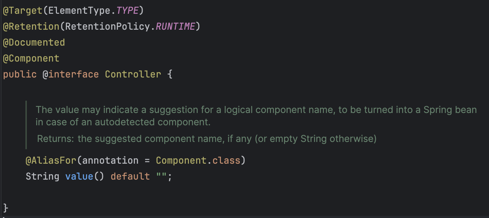
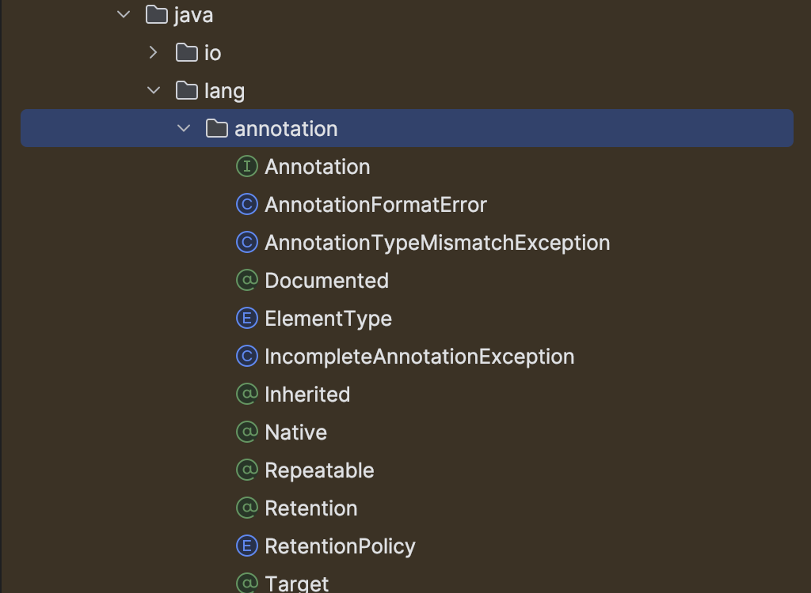

### 1. <span style="color: #289e8e">어노테이션</span>이 문득 궁금해진 순간
---

다들 프로그래밍을 이용하면서 어노테이션이라는 것을 사용해 봤으리라 생각한다.  
특히, 스프링기반 백엔드 개발자라면 `@Controller, @Service`.. 등의 어노테이션을 자연스럽게 사용하고 있을 것이다.  

잠시, 프레임워크를 사용할 때 어노테이션을 유독 많이 사용한다..?

프레임워크의 특징은...제어의 흐름을 주도적으로 가져간다는 것이고..흐름을 주도하기 위해서는 개발자에게 많은 정보를 요구할 수 밖에없고.. 개발자가 제공하는 정보를 적절하게 정리해서 사용을 해야한다.

> "아! 어노테이션은 프로그램이 코드정보를 잘 인지하고 코드를 분류하기 위한 `명찰` 이구나 !!"

처음 자바의 정석을 읽으면서 와닿지않던 개념이 갑자기 머리에 박히기 시작했다. 다시 공부해보도록 하자.

<br/>
<br/>

### 2. 어노테이션 왜 <span style="color: #289e8e"> 필요</span>할까?
---
위키피디아에 의하면  
> Annotation을 직역하면 `주석`이고, 조금 더 풀어쓴 내용을 보면 `메타정보` 를 담고 있는 코드라고 한다.

음... 그렇군... (처음 Annotation에 대한 설명을 보았을 때 반응)  
무언가 잘 와닿지 않는다.

그렇다면 "왜 메타정보가 필요할까?" 로 필요성 관점으로 접근해보자.

어노테이션은 자바언어차원에서 지원하는 것임으로 스프링 어노테이션이 아닌 표준 어노테이션 중 하나인 `@Override`를 예시로 어노테이션의 필요성을 살펴보자.


```java:title=@Override_필요성
public class Parent {
    public void display() {
        System.out.println("안녕 나는 부모클래스");
    }
}

public class Child extends Parent {
    @Override
    public void displayyy() {                   //display를 displayyy라고 오타
        System.out.println("안녕 나는 자식 클래스");
    }
}
```
상속을 한 후 재정의한 메서드에 @Override 어노테이션이 없다면, 다음과 같이 자식에서 재정의하고 싶은 메서드명에 오타가 발생해도 정상적으로 컴파일 될 것이다.    
메서드 재정의를 한 것이 아닌 displayyy라는 메서드가 자식클래스에 추가 된 것이기 때문이다.

이 문제는 @Override라는 어노테이션을 사용함으로써 해결이 가능해진다.  
컴파일러에 해당 어노테이션이 붙은 메서드를 점검하는 로직을 작성하면된다.  
즉, @Override라는 명찰이 붙은 메서드는 메서드의 시그니처를 확인하고 올바르지 않으면 컴파일에러를 발생시키면 된다.


나아가서,  

제어의 흐름을 주도하는 프레임워크인 스프링은 특정 시점에 문제를 해결해줄 오브젝트를 프로그램 분류하고 찾아야한다.  
이때, 어노테이션과 같은 명찰이 있으면 적절한 오브젝트를 정확하고, 잽싸게 데려올 수 있다.


따라서! `어노테이션 사용의 필요성(장점)`은 다음과 같이 정리해볼 수 있다.

1. 프로그램 안정성이 향상됨
2. 런타임시점에 동적인 행동이 가능해짐(리플렉션을 활용)
3. 프레임워크, 라이브러리가 제공하는 기능을 쉽게 사용 가능해짐
4. 표준화된 문제해결 방식으로 코드 유지보수성, 가독성 증가
5. 코드의미를 더 할 수 있음
6. 보일러플레이트 코드를 제거 할 수 있음
...

<br/>
<br/>

### 3. 어노테이션<span style="color: #289e8e"> 종류</span> 와 <span style="color: #289e8e">선언</span>
---

자바, 스프링에서 마법같은 역할을 하던 어노테이션  
다들 어떤 구현체가 있길래하는 두근두근한 마음으로 딸깍! 코드를 눌러 본적이 있지 않던가 ?

그리고 기대와는 달리 아래와 같은 아주 간략한 코드를 보고 차게 식은적이 있을 것이다. 왜냐하면 그냥 명찰일 뿐이니깐 !  
(우리가 기대하는 구현체는 저 명찰을 보고 명령을 내릴 프레임워크의 코드상에 있을 것이다.)



자 그렇다면 저 어노테이션(명찰)이 어떤 형식으로 이루어져있는지 알아보도록하자.  

보통 어노테이션은 3가지의 종류로 나누어서 생각해볼 수 있다.

`기본 어노테이션` : JDK에서 제공하는 표준 어노테이션이다. 주로 컴파일러에게 정보를 주기 위한 용도로 많이 사용된다.  
ex) @Override : 상속된 클래스에 오버라이드 목적으로 함수를 작성했지만 함수명에 오탈자가 있으면 확장된 함수로 인식하는 문제를 방지할수 있다.

`메타 어노테이션` : JDK에서 제공하는 표준 어노테이션이지만, 어노테이션에 정보 제공하는 어노테이션이다.  
ex) @Target : 커스텀 어노테이션을 만들때 어노테이션이 적용가능 대상을 제한시켜준다.

위의 어노테이션은 java.lang.annotation에 정의되어 있다.




<center>[java.lang.annotation]</center>
<br/>

`커스텀 어노테이션` : 메타 어노테이션을 활용해서 사용자가 만든 어노테이션이다.   
ex) @Controller : 스프링 개발자가 만든 커스텀 어노테이션, 컴포넌트 스캔의 대상이되며 스프링MVC패턴에서 view레이어를 마커한다.

#### 3.1 커스텀 어노테이션 만드는법
아래의 예시를 통해서 살펴보자.

##### 어노테이션 선언
```java:title=어노테이션_선언
@Retention(RetentionPolicy.RUNTIME)
@Target(ElementType.METHOD)
public @interface 어노테이션명 {
    타입 요소명() default "요소 디폴트 값";
}
```
위와 같이 정의하고, 커스텀 어노테이션은 @Retention, @Target 2개의 메타 어노테이션을 필요로 한다.
* **@Retention** : 메타 어노테이션, 어노테이션이 유지되는 기간을 설정한다.

| 인자 값         | 설명                                                         |
| ------------------------- | ------------------------------------------------------------ |
| RetentionPolicy.SOURCE  | 어노테이션은 소스 파일에서만 유지된다. 컴파일 과정 중에는 이 어노테이션 정보가 사용되지만, 컴파일된 .class 파일에는 포함되지 않으므로 주로 컴파일러에 의해 사용되는 어노테이션에 적용된다. ex): @Override, @SuppressWarnings |
| RetentionPolicy.CLASS   | 컴파일 시점에서 필요한 정보를 제공하고, 런타임에는 필요 없는 경우에 사용된다.(디폴트 값) |
| RetentionPolicy.RUNTIME | 어노테이션은 .class 파일에 포함되며, 런타임에도 JVM에 의해 유지됩니다. 리플렉션을 통해 런타임에 어노테이션 정보를 읽을 수 있다. ex) 스프링의 @Autowired |


* **@Target** : 메타 어노테이션이다, 어노테이션이 적용가능한 대상을 설정한다.
| 인자 값                | 설명                                                         |
| ----------------------------- | ------------------------------------------------------------ |
| ElementType.TYPE            | 클래스, 인터페이스 (포함 어노테이션 타입), 또는 열거 타입의 선언에 어노테이션을 적용할 수 있음 |
| ElementType.FIELD           | 필드 선언(멤버 변수, 열거 상수 포함)에 어노테이션을 적용할 수 있음 |
| ElementType.METHOD          | 메서드 선언에 어노테이션을 적용할 수 있음                    |
| ElementType.PARAMETER       | 메서드의 매개변수 선언에 어노테이션을 적용할 수 있음         |
| ElementType.CONSTRUCTOR     | 생성자 선언에 어노테이션을 적용할 수 있음                    |
| ElementType.LOCAL_VARIABLE  | 지역 변수 선언에 어노테이션을 적용할 수 있음                 |
| ElementType.ANNOTATION_TYPE | 어노테이션 타입 선언에 어노테이션을 적용할 수 있음           |
| ElementType.PACKAGE         | 패키지 선언에 어노테이션을 적용할 수 있음                    |
| ElementType.TYPE_PARAMETER  | 타입 매개변수 선언에 어노테이션을 적용할 수 있음             |
| ElementType.TYPE_USE        | 타입 사용의 모든 선언에 어노테이션을 적용할 수 있음(타입 선언뿐 아니라 모든 타입의 사용 위치) |

##### 어노테이션 적용
```java:title=어노테이션_적용 
public class Test {

    @어노테이션명(요소명 = "cola")
    public void method1(){
        //메서드1 로직
    }

    @어노테이션명(요소명 = "cider")
    public void method2(){
        //메서드2 로직
    }
}
```

##### 어노테이션 정보 활용
```java:title=어노테이션_정보_활용
public class AnnotationTester {

	public static void main(String[] args) throws Exception {
		Parse(Test.class);
	}

	public static void Parse(Class<?> clazz) throws Exception{
		Method[] declaredMethods = clazz.getDeclaredMethods();
		for (Method method : declaredMethods) {
			if (method.isAnnotationPresent(어노테이션명.class)){
				Label anno = method.getAnnotation(어노테이션명.class);
				System.out.println(anno.요소명());
			}
		}
	}
}
```
실행결과
<p style="margin: 0; padding-left: 1rem; color: white; background: #2d2d2d;" >> cola</p>
<p style="margin: 0; padding-left: 1rem; color: white; background: #2d2d2d;" >> cider</p>

<br/>

위와 같이 어노테이션을 호출해서 로직을 작성할 수 있다!  
예시에서는 간단히 어노테이션의 요소값 파라미터를 출력하는데 불과하지만, 해당 정보를 이용해서 다양하고 유용한 로직을 작성할 수 있게 된다.

<br/>
<br/>

### 4. 마무리
---
결국 어노테이션은 프로그램에게 코드에 대한 정보를 더 잘 제공하기 위해 사용된다.
프로그램인 컴파일러, 프레임워크, 라이브러리 등등은 제공된 정보를 기반으로 더 유용한 처리를 가능하게 해준다. 

메서드와 클래스는 각자의 역할에 대한 기능정의 작성에 최적화 되어있는 것 같다.
하지만 실제로 이제 그 코드를 활용해서 동작을 시켜야하는 프로그램 입장에서는 기능만으로는 조금 정보가 부족할지도 모른다. 그나마 코드의 메타정보를 얻을 수 있는 방법이 메서드명과 클래스명의 명명으로부터 유추일 것이다. 명명 규칙을 이용하여 메타정보를 알아내는 전략은 사용자의 코딩 자유도를 낮출지도 모른다.
하지만 이를 잘 활용한 프레임워크도 있었다, 바로 JPA.. 여기서는 오히려 메소드명에 메타정보(행위, 목적성)를 추가하는 것이 코드 컨벤션에 도움이 되는 것 같다.   
(결국, 전달해야할 정보량이 많아지면 어노테이션 이용을 함)

자바로 코딩을 하다보면 마법같은 일들을 대신해주는 메서드나 클래스의 구현체를 탐험하러다니는데, 문득 어노테이션을 탐험했을 때는 단순한 코드밖에 없어서 띠용한적이 있었는데... 그것은 단순한 명찰이었기 때문이었다. 만약 자세한 선구자들의 지혜가 궁금하다면 그 어노테이션을 리플렉션API로 집어가는 그곳을 방문해야한다. 혹은 컴파일러 공식문서를...

그곳이 보물창고였다 🏝️🏴‍☠️

읽어주셔서 감사합니다.

<br/>
<br/>

### 참고
---
[자바의 정석, 남궁성 지음]()  


