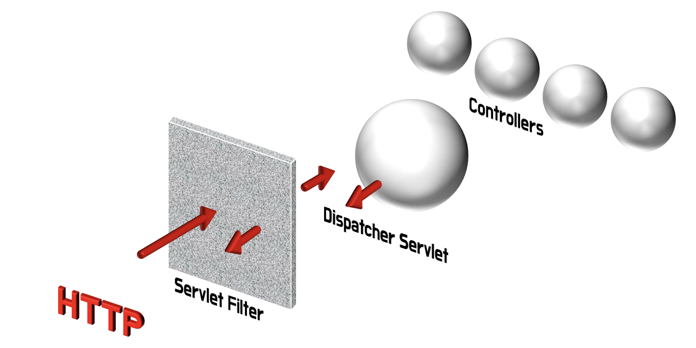
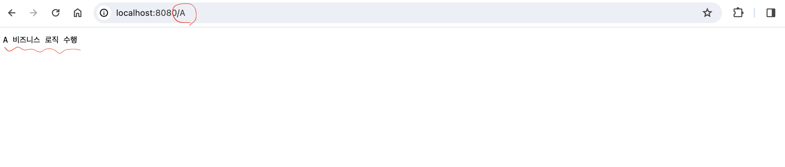

### 1. <span style="color: #289e8e">리플렉션</span>이 문득 궁금해진 순간
---

어노테이션에 대해서 자세히 공부를 하던 중 <a href="https://geunskoo.com/blog-2024-04-16/study-for-annotation/" class="href-md">여기</a>  

자바 프로그램이 (컴파일러, 프레임워크, 라이브러리 등등) 수집된 어노테이션을 어떻게 끌어가서 활용을 하는지 궁금해졌다.  
그리고 이때 Reflection API를 사용한다는 것을 알게되었다.  

따라서 리플렉션 API에 대해서 학습하고 이것을 활용하는 경험을 하고자한다.  

<br/>
<br/>

### 2. <span style="color: #289e8e">리플렉션</span>에 대해서
---
 자바 리플렉션 API는 자바 학습에 있어서 바이블인 자바의 정석(남궁성 저)에서도 다루지 않는다.  
기본적인 학습자의 레벨에서는 불필요한 수준이라고 판단하셨나보다.

그래서, 오라클 공식 문서를 찾아보았다.  <a href="https://docs.oracle.com/javase/8/docs/technotes/guides/reflection/index.html" class="href-md">여기</a>  

#### 2.1 리플렉션
> `리플렉션(Reflection)`  
> Java에서 클래스가 로드될 때 해당 클래스의 필드, 메소드, 생성자 등의 정보를 파악하고 이를 활용할 수 있게 하는 기술이다.

 이를 통해 Java 코드는 보안 제한 내에서 해당 요소들을 직접 조작하거나 사용할 수 있고, 리플렉션 API는 런타임에 객체의 public 멤버에 접근하거나 특정 클래스에 의해선언된 멤버에 접근할 필요가 있는 애플리케이션을 지원한다. 또한, 이 기술은 접근 제어를 우회할 수 있는 기능도 제공한다고 한다.

 즉, 리플렉션은 사용하면 누릴 수 있는 이점을 정리하면 아래와 같다.

#### 2.2 리플렉션의 용도와 이점  
1. **런타임 유연성**: 프로그램 실행 중에 클래스, 메서드, 필드 정보를 검사하고 수정할 수 있어, 동적인 동작 가능해짐    
2. **디버깅 및 테스팅 용이**: private 멤버(필드, 메서드)에 접근하여 테스트 코드를 작성하거나 디버깅할 때 유용함  
3. **유연한 API 호출**: 사용할 클래스나 메서드가 컴파일 시점에 결정되지 않고 런타임에 결정되어야 할 때 이를 가능케함  
4. **프레임워크 개발 지원**: 많은 자바 프레임워크(Spring, Hibernate..등)가 내부적으로 리플렉션을 사용하여 유연성과 확장성을 제공함  
5. **타입 추상화**: 구체적인 클래스 타입을 모르는 상태에서도 해당 타입의 객체를 다룰 수 있어짐  


그렇다면 우리는 어떻게 리플렉션을 사용할 수 있을까?  
당연히, 간단하게 사용할 수 있도록 자바에서는 리플렉션 API를 제공하고 있다. 그 중 자주 등장하는 몇몇 함수만 알아보도록 하자.


#### 2.3 자주 사용하는 API
| 클래스   | 메서드                                        | 설명                                                     |
| -------- | -------------------------------------------- | ---------------------------------------------------- |
| Class  | getMethod(String, Class<?>...)                 | 지정된 이름과 매개변수 타입을 가진 공개 메서드 반환 |
| Class  | getDeclaredMethod(String, Class<?>...)         | 클래스에서 선언된 모든 메서드(공개 또는 비공개) 중 지정된 이름과 매개변수를 가진 메서드 반환 |
| Class  | getField(String)                               | 지정된 이름의 public 필드 반환                        |
| Class  | getDeclaredField(String)                       | 클래스에서 선언된 모든 필드(public 또는 private) 중 지정된 이름의 필드 반환 |
| Method | invoke(Object, Object...)                      | 지정된 객체에서 이 메서드를 호출함. 메서드가 정적인 경우 첫 번째 매개변수는 무시될 수 있음 |
| Field  | get(Object)                                    | 지정된 객체에서 이 필드의 값을 반환함. 필드가 정적인 경우 매개변수는 무시될 수 있음 |
| Field  | set(Object, Object)                            | 지정된 객체에서 이 필드의 값을 세팅함. 필드가 정적인 경우 첫 번째 매개변수는 무시될 수 있음 |

더 많은 API 규격(인터페이스)이 존재하고 더 상세한 실행 로직이 궁금하다면,  
오라클 공식 문서 <a href="https://docs.oracle.com/javase/8/docs/technotes/guides/reflection/index.html" class="href-md">여기</a>와 프로젝트의 java.lang.reflection 패키지를 살펴보면 된다.

<br/>
<br/>

### 3. 리플렉션 API의 <span style="color: #289e8e">활용</span>
---
#### 3.1. 생각하기
리플렉션 API는 유연한 확장을 제공한다고 한다. 대체 뭐가 유연하다는 것 일까?  
유연한다는 것은 변화(변경)로부터 자유롭다는 뜻이고, 사용자가 원하는대로 하면 그에 맞게 대응해준다는 것이다.  

이것을 스프링 프레임워크를 사용하는 상황에서 생각해보도록하자.  
우리는 스프링부트를 이용하면 빠르게 웹개발을 시작할 수 있고, 순식간에 API를 찍어낼 수 있다.  
어떻게 순식간에 찍어낼 수 있었던 것일까? 

당연히 이유는 간단했다. 복잡한 설정 및 로직들은 이미 스프링/스프링부트 프레임워크가 끝내놓았기 때문이다.  
우리가 프레임워크에서 정해놓은 규칙으로 코딩하면 그들은 우리의 의도를 빠르게 판단하고 원하는 일을 수행해준다.

스프링은 여러개의 역할을 가진 어노테이션이라는 명찰을 만들어놓고, 사용자가 만든 코드에 그 명찰을 달아 놓으면   
<u>그 명찰을 단 코드를 쭈욱 끌어가서는 "이 명찰을 달고 있으니 이걸 해달라는거지 ?" 라고 판단을 한다.</u>  

밑줄 그어진 저 부분이 스프링이 부리는 마법같은 일이다.  
이것을 하기위해서는 리플렉션이 딱! 필요하다.


 끊어서 정리를 해보면,  
프레임워크 코드는 이미 작성이 완료되어 우리에게 제공된 상태이다.(ReadOnly)  
사용자가 의도하는 코드는 양이 얼마나 늘어날지도 모르고 런타임 시점까지 프레임워크는 알지못한다.  
런타임 시점에서 프레임워크는 사용자의 코드를 훑어보고 용도에 맞게 가져와야한다.
리플렉션을 이용해서 이를 수행한다.

#### 3.2. 직접 구현해보기

스프링은 많은 아주 똑똑한 사람들에의해 극도로 고도화되고, 책임분리가 잘되어있어 딱 한 시점에서의 코드가 리플렉션 API를 이용해서 그 정보를 가공하는 코드를 발견 할 수는 없었다. 우리는 간단히 원리만 이해하면됨으로 @MyController라는 커스텀 어노테이션이 붙은 메서드를 쭉 끌어가서 Http 요청이 들어오는 가장 앞단인 서블릿 필터영역에서 특정 url이 들어왔을 때 내가 원하는 메서드로 요청을 보내는 코드를 작성해보려고 한다.  
즉, 실습 전략은 아래와 같다.  

[실습 전략]  
1. Filter 인터페이스를 구현한 MyFilter에서 HttpRequest 요청을 처리하자.
2. 요청이 들어왔을 때, 리플렉션 API를 이용해서 @MyController이 적용된 클래스들을 찾는다.
3. 찾은 클래스들의 메서드들 중의 @MyMapper이 적용된 메서드를 찾는다.
4. 찾은 메서드의 @MyMapper 어노테이션 요소 값(uri, httpMethod)을 필터에 들어온 요청 값과 비교한다.
5. 요청 내용을 수행할 수 있는 메서드를 실행한다.

<span style="color: gray; font-size: 0.85rem">(⚠️ 경고: 실습은 실제 스프링이 컨트롤러 빈들을 리플렉션을 이용하여 읽어오는 시점과 그 정보를 활용하여 매칭시켜주는 시점은 모두 실습과 다릅니다! )</span>




<center>[참고 이미지]</center>
<center>Servlet Filter와 같은 시점에서 http 요청을 처리하는 로직을 만들어보자.</center>

<br/>
<br/>

`1. Filter 인터페이스를 구현한 MyFilter에서 HttpRequest 요청을 처리하자.`  
 서블릿 필터처럼 동작하는 나만의 커스텀 MyFilter를 구현하면된다. doFilter 메서드의 request 파라미터에 http 요청 정보가 들어 있다.  
스프링 서버를 띄우고 localhost:8080/hello 주소줄에 입력하면 GET 요청이 호출되어 아래 코드의 주석과 같은 결과가 나올 것이다.

```java:title=MyFilter.java
@Component
public class MyFilter implements Filter {

    @Override
    public void doFilter(ServletRequest request, ServletResponse response, FilterChain chain) throws IOException, ServletException {

        //Request METHOD/URI 값 구하기
        HttpServletRequest http = (HttpServletRequest) request;
        String reqMethod = http.getMethod();  // GET
        String reqUri = http.getRequestURI(); // /hello
    }
}
```

<br/>

`2. 요청이 들어왔을 때, 리플렉션 API를 이용해서 @MyController이 적용된 클래스들을 찾는다.`  
위에서 소개한 자바의 Reflection API를 이용해서 @MyController가 붙은 클래스들을 수집하려고 했으나, 해당 API로는 가져오는 것은 다소 복잡함으로 `org.reflections`라는 라이브러리 이용해서 자바의 class path를 전부 훝어보았다.  
(사실, 스프링도 자바의 reflections을 쓰는 것이 아닌 jvm레벨에서 동작하는 코드를 자체적으로 만들어서 사용하는 것 같다.)

```java:title=MyFilter.java
@Component
public class MyFilter implements Filter {

    @Override
    public void doFilter(ServletRequest request, ServletResponse response, FilterChain chain) throws IOException, ServletException {

        // 1. Request METHOD/URI 값 구하기
        HttpServletRequest http = (HttpServletRequest) request;
        String reqMethod = http.getMethod();  // GET
        String reqUri = http.getRequestURI(); // /hello

        // 2. org.reflections 라이브러리 활용
        Reflections reflections = new Reflections(new ConfigurationBuilder()
                        .setUrls(ClasspathHelper.forJavaClassPath())
                        .addScanners(new TypeAnnotationsScanner(), new SubTypesScanner()));

        // 3. MyController 어노테이션이 붙은 모든 클래스 찾기
        Set<Class<?>> annotatedClasses = reflections.getTypesAnnotatedWith(MyController.class);
        for (Class<?> cls : annotatedClasses) {
            System.out.println("클래스: " + cls.getSimpleName()); //클래스: ApiController
        }
    }
}
```
```java:title=MyController.java
//REST API 통신에서 사용될 클래스임을 알리기위한 어노테이션

@Target(ElementType.TYPE)
@Retention(RetentionPolicy.RUNTIME)
public @interface MyController {
}
```
```java:title=MyMapping.java
//특정 Http 요청을 담당할 메서드임을 알리기위한 어노테이션

@Target(ElementType.METHOD)
@Retention(RetentionPolicy.RUNTIME)
public @interface MyMapping {
    String uri() default "/";
    String method() default  "GET";
}
```
```java:title=ApiController.java
//위의 두 어노테이션을 적용시킨 API 처리를 위한 로직

@MyController
public class ApiController {

    @MyMapping(uri = "/A", method = "GET")
    public String A(){
        return "A 비즈니스 로직 수행";
    }

    @MyMapping(uri = "/B", method = "GET")
    public String B(){
        return "B 비즈니스 로직 수행";
    }
}
```

<br/>

`3. 찾은 클래스들의 메서드들 중의 @MyMapper이 적용된 메서드를 찾는다.`  
`4. 찾은 메서드의 @MyMapper 어노테이션 요소 값(uri, httpMethod)을 필터에 들어온 요청 값과 비교한다.`  
`5. 요청 내용을 수행할 수 있는 메서드를 실행한다.`  

```java:title=MyFilter.java(코드전체)
@Component
public class MyFilter implements Filter {

    @Override
    public void doFilter(ServletRequest request, ServletResponse response, FilterChain chain) throws IOException, ServletException {
        
        //Request METHOD/URI 값 구하기
        HttpServletRequest http = (HttpServletRequest) request;
        String reqMethod = http.getMethod();
        String reqUri = http.getRequestURI();

        Reflections reflections = new Reflections(new ConfigurationBuilder()
                .setUrls(ClasspathHelper.forJavaClassPath())
                .addScanners(new TypeAnnotationsScanner(), new SubTypesScanner()));

        // MyAnnotation 어노테이션이 붙은 모든 클래스 찾기
        Set<Class<?>> annotatedClasses = reflections.getTypesAnnotatedWith(MyController.class);
        for (Class<?> cls : annotatedClasses) {
            Method[] methods = cls.getDeclaredMethods(); // highlight-line
            for (Method method : methods) { // highlight-line
                MyMapping anno = method.getAnnotation(MyMapping.class); // highlight-line
                if (anno != null) { // highlight-line
                    String myUri = anno.uri(); // highlight-line
                    String myMethod = anno.method(); // highlight-line
                    // @MyMapping 어노테이션 정보를 이용하여 Request요청을 처리해줄 메서드 찾기. 
                    try { // highlight-line
                        if (reqUri.equals(myUri) && reqMethod.equalsIgnoreCase(myMethod)) {// highlight-line
                            ApiController helloController = new ApiController();// highlight-line
                            String resp = (String) method.invoke(helloController); // highlight-line

                            response.setContentType("text/plain; charset=UTF-8");  
                            PrintWriter out = response.getWriter();
                            out.print(resp); 
                            out.flush();  
                            out.close();  
                        }
                    } catch (Exception e) {
                        throw new ServletException("에러 발생", e);
                    }
                }
            }
        }
    }
}
```

아래와 같이 localhost:8080/A 으로 요청을 보내면, 성공적으로 내가 원하는 로직이 처리 되는 모습을 확인 할 수 있다!





<center>[localhost:8080/A 요청]</center>

<br/>
<br/>

### 4. 마무리
---
리플렉션 API를 잘 활용하면 런타임 시점에 유연한 동작이 가능하다는 것을 알게되었다.   
스프링프레임워크에서 동작하는 원리를 그대로는 구현한 것이 아닌 일부의 느낌을 내는 듯한 코드였지만, Reflection 코드가 어떤 맥락으로 동작하는 지를 이해하기에는 충분한 경험이었던 것 같다.

혹시나 이상한점이 있다면 피드백 부탁드리겠습니다. 감사합니다.

### 참고
---
[baeldung.com의 org.reflections](https://www.baeldung.com/reflections-library)  
[메타코딩](https://www.youtube.com/playlist?list=PL93mKxaRDidFGJu8IWsAAe0O7y6Yw9f5x)  
[java reflection docs](https://docs.oracle.com/javase/8/docs/technotes/guides/reflection/index.html)
