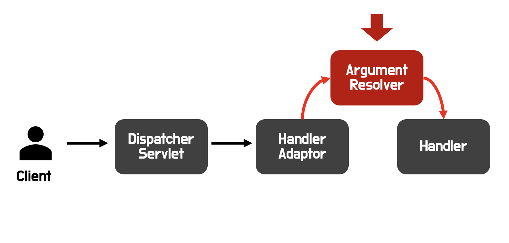

### 1. 상황
---
 스타벅스 온라인스토어 클론코딩 프로젝트를 구현하던 중 나는 스프링시큐리티와 유저 서비스 개발을 담당했었다. <a href="https://github.com/spharos-clone-6" class="href-md">여기</a>   
함께 백엔드를 개발하는 팀원들은 4명이었는데, 팀원들 다수가 node개발을 해왔던터라. 스프링 프레임워크에 대해서 조금 낯설어 했다.  
하지만, 프로젝트 마감기한이 정해져 있었고 빠르고 정확한 구현이 필요했다.  

유저의 인증이 필요한 페이지가 생각보다 많았기에 나는 팀원들에게 최대한 빠르게 인증/인가처리된 유저의 정보를 Controller에 넘겨줘야했다.
Spring Security를 적용시키면 인가처리된 유저의 정보는 Autentication라는 객체로 Controller 메서드의 파라미터로 접근할 수 있었다.
하지만, 이러한 개념은 한정된 시간자원아래 스프링 개발이 익숙치 않은 팀원에게 전파하는 것은 쉽지 않은 일이었고, 조금 더 다듬어진 정보를 제공해줄 필요성이 있었다.  

그래서 HandlerMethodArgumentResolver를 이용하여 팀원이 개발하는 Controller 앞단에서 인가된 유저의 필요정보를 재구성해서 제공하기로 했다.  

<br/>
<br/>

### 2. <span style="color: #289e8e">HandlerMethodArgumentResolver</span>에 대해서
---
docs.spring.io <a href="https://docs.spring.io/spring-framework/docs/current/javadoc-api/org/springframework/web/method/support/HandlerMethodArgumentResolver.html" class="href-md">여기</a> 에 해당 인터페이스에 대한 상세한 내용을 살펴볼 수 있었다.


#### 2.1. 정의

스프링 3.1에서 org.springframework.web.method.support 패키지에 추가된 인터페이스이다.  
> `HandlerMethodArgumentResolver (Interface)`   
> "Strategy interface for resolving method parameters into argument values in the context of a given request."    
> "주어진 요청의 맥락에서 메소드 매개변수를 인수 값으로 해석하는 전략 인터페이스."

즉, 스프링 MVC에서 요청 데이터를 컨트롤러 <u>메소드의 매개변수로 변환</u>하는 역할을 수행한다.

해당 인터페이스 구현체는 2개의 메서드를 구현해야하는데 아래와 같다.

| 메서드 시그니처                          | Description                                                  |
| ------------------------------------ | ------------------------------------------------------------ |
| Object        **resolveArgument**(MethodParameter parameter, ModelAndViewContainer mavContainer, NativeWebRequest webRequest, WebDataBinderFactory binderFactory) | 주어진 요청으로부터 메소드 매개변수를 인수 값으로 변환하는 기능을 수행 |
| boolean       **supportsParameter**(MethodParameter parameter)                 | 해당 리졸버가 특정 매개변수를 지원하는지 여부를 판단(자신이 사용할 파라미터를 정의) |

<center>[구현 메서드 표]</center>
<br/>
<br/>

그렇다면 HandlerMethodArgumentResolver로 무엇을 할 수 있는지 살펴보자.

#### 2.2. 용도

1. **커스텀 바인딩**: 사용자 정의 타입을 자동으로 HTTP 요청 데이터로부터 매핑하고, 컨트롤러 매개변수로 전달가능  
2. **데이터 출처 다양화**: HTTP 헤더, 쿠키, 세션, URL 경로 변수 등 다양한 소스로부터 데이터를 수집하여 컨트롤러 메소드의 매개변수로 사용가능
3. **조건별 로직 구현**: 요청의 특정 조건에 따라 매개변수의 바인딩 방식을 변경하거나, 특정 요청에만 적용되는 맞춤형 로직을 구현가능  
4. **보안 및 유효성 검증**: 매개변수 바인딩 과정에서 보안 검사나 데이터 유효성 검증을 추가하여, 안전하고 신뢰할 수 있는 데이터 처리 보장  

#### 2.3 동작 시점



<center>[HandlerMethodArgumentResolver 동작 시점]</center>

1. 클라이언트가 요청을 보내고 디스패쳐 서블릿이 요청을 받음 
2. **핸들러 매핑으로 적절한 컨트롤러 찾기**: DispatcherServlet은 등록된 핸들러 매핑을 사용하여 요청을 처리할 적절한 컨트롤러의 메소드(핸들러 메소드)를 결정
3. **핸들러 어댑터 결정:** 선택된 핸들러 메소드를 실행할 수 있는 핸들러 어댑터를 찾음.
4. <u>**핸들러 메소드 실행 전 준비**</u>: 찾은 핸들러 어댑터는 `HandlerMethodArgumentResolver`를 호출하여 각 매개변수가 필요로 하는 인자를 준비함. (이 단계에서 각 매개변수에 맞는 리졸버가 활성화되어 매개변수를 해석하고, 요청에서 필요한 값을 추출하거나 변환함)
5. <u>**메소드 매개변수 해석**</u>: 각 `HandlerMethodArgumentResolver`는 지원하는 매개변수 타입을 확인하고`(supportsParameter메서드)`, 해당 타입의 매개변수를 처리할 수 있을 때 요청 데이터로부터 필요한 값을 추출하거나 생성한다`(resolveArgument메서드)`.
6. **핸들러 메소드 실행**: 모든 매개변수가 해석되고 준비된 후, 핸들러 어댑터는 최종적으로 컨트롤러의 메소드를 호출함. 이 때, 해석된 매개변수 값이 메소드 인자로 전달된다.

</br>
</br>

### 3. 프로젝트에  <span style="color: #289e8e">반영</span>
---
목표는 아래의 코드와 같이 간단하게 @LoginUser라는 어노테이션을 사용하면 API 요청을 보내는 로그인 유저의 정보를 넣어주도록 하는 것이다.
흡사, @RequestBody의 사용처럼!! 기존에는 Autentication을 통해서 로그인 유저의 정보를 가져오고 있었다.(SpringSecurity 프레임워크)

```java:title=UserController.java
// as-is
@GetMapping("/bill")
public ResponseBill getBill(Autentication auth) { //highlight-line
    //컨트롤러 로직
}

// to-be
@GetMapping("/bill")
public ResponseBill getBill(@LoginUser User user) { //highlight-line
    //컨트롤러 로직
}
```
<br/>

[반영 전략]

1. Controller Method 파라미터에서 사용될 어노테이션 정의  
2. HandlerMethodArgumentResolver의 구현체 정의  
3. WebMvcConfigurer의 구현체(설정)에서 HandlerMethodArgumentResolver 목록에 생성한 구현체 등록  


`1. Controller Method 파라미터에서 사용될 어노테이션 정의`  
@LoginUser라는 커스텀어노테이션을 정의하자. (관련 게시물 <a href="https://geunskoo.com/blog-2024-04-16/study-for-annotation/" class="href-md">여기</a>)  
컨트롤러 메서드의 파라미터에서 사용될 것임으로 @Target은 PARAMETER로 설정하고 @Retention은 RUNTIME으로 하면 된다.
```java:title=LoginUser.java
@Target(ElementType.PARAMETER)
@Retention(RetentionPolicy.RUNTIME)
public @interface LoginUser {
}
```
<br/>

`2. HandlerMethodArgumentResolver의 구현체 정의`  
SpringSecurity 프레임워크를 이용해서 유저의 인증/인가를 구현했다. 그리고 해당정보를 가져오기 위해서 SecurityContextHolder에서 Autentication을 
가져와서 유저의 정보를 가져와서 세팅하도록 처리했다.(뒷단의 서비스코드에서 공통적으로 발생하던 코드를 한곳에서 처리가 가능해짐)
```java:title=LoginUserMethodArgumentResolver.java
public class LoginUserMethodArgumentResolver implements HandlerMethodArgumentResolver {

    @Override
    public boolean supportsParameter(MethodParameter parameter) {
        return parameter.hasParameterAnnotation(LoginUser.class);
    }

    @Override
    public Object resolveArgument(MethodParameter parameter, ModelAndViewContainer mavContainer,
        NativeWebRequest webRequest, WebDataBinderFactory binderFactory) throws Exception {
        Authentication authentication = SecurityContextHolder.getContext().getAuthentication();
        if (authentication != null && authentication.getPrincipal() instanceof UserDetails) {
            UserDetails userDetails = (UserDetails) authentication.getPrincipal();
            return User.withUserDetail(userDetail)
        }
    }
}
```

<br/>

`3. WebMvcConfigurer의 구현체(설정)에서 HandlerMethodArgumentResolver 목록에 생성한 구현체 등록`
해당 인터페이스는 스프링 MVC의 구성을 커스터마이즈하는 데 사용된다. 오버라이드할 수 있는 메서들 중 addArgumentResolvers(...)가 있다.
해당 메서드를 통해서 내가 커스텀한 HandlerMethodArgumentResolver 구현체를 등록할 수 있다.
```java:title=WebMvcConfig.java
@Configuration
@RequiredArgsConstructor
public class WebMvcConfig implements WebMvcConfigurer {

    private final LoginUserMethodArgumentResolver loginUserMethodArgumentResolver;

    @Override
    public void addArgumentResolvers(List<HandlerMethodArgumentResolver> resolvers) {
        resolvers.add(loginUserMethodArgumentResolver);
    }
}
```

<br/>

위에까지의 코드를 작성하니, 성공적으로 컨트롤러의 메서드의 파라미터에 @LoginUser라는 어노테이션을 붙이면 내가 정의해둔 User타입으로 가공한 로그인 유저의 정보가 넘어오는 것을 확일 할 수 있었다.

### 4. 결론
---
API를 받고 비즈니스 로직으로 가기전, 스프링MVC에서는 생각보다 많은 것을 해주고 있다는 것을 알게 되었다.  
스프링의 유연한 확장을 지원하고 있었고, 그 구조에 대해서 잘면 다음과 같은 아주 편리하고 좋은 기능을 적용할 수 있다는 사실에 놀라웠다.  
이 기술을 적용했을 때, 인증된 유저에 대한 코드를 일관적으로 처리할 수 있었다는게 장점이었다. 그리고 어노테이션으로 더 명료하게 해당 값을 접근해서 가져온다는 것이 팀원들에게 해당 기술을 전파하기도 쉬워, 협업적으로 많은 도움이 되었다.

감사합니다.

### 참고
---
* [docs.spring.io](https://docs.spring.io/spring-framework/docs/current/javadoc-api/org/springframework/web/method/support/HandlerMethodArgumentResolver.html)