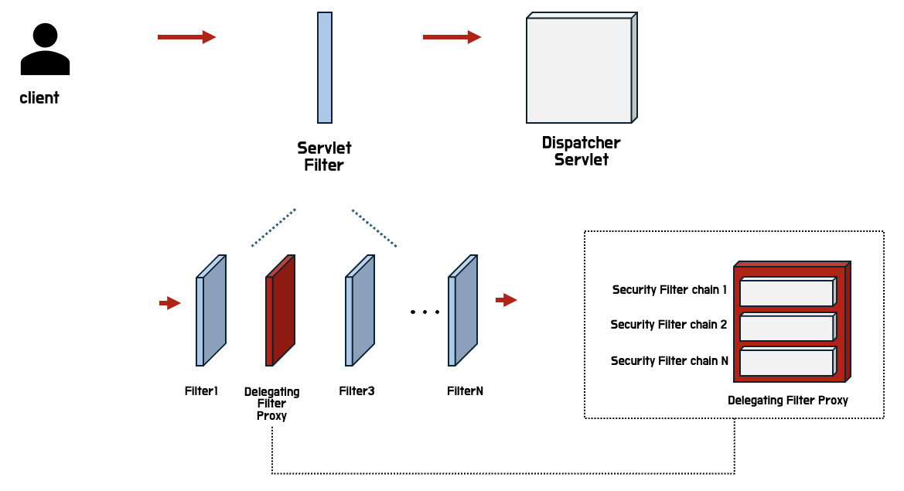
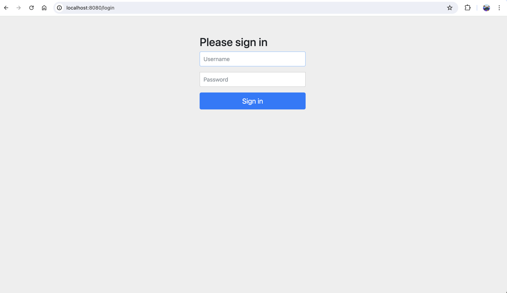
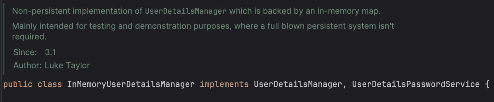
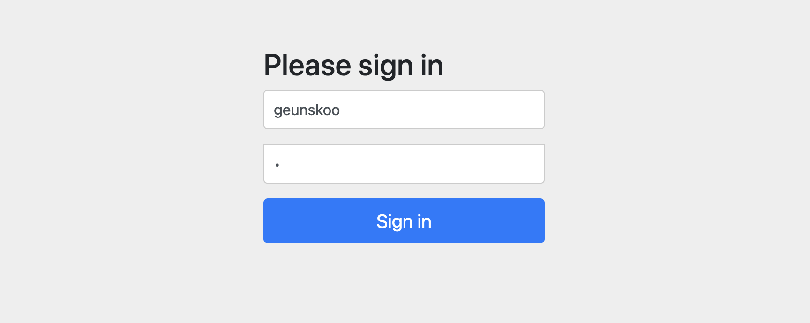
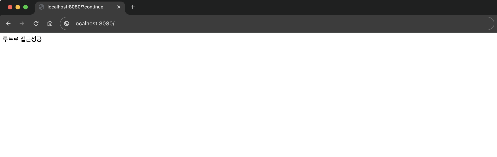
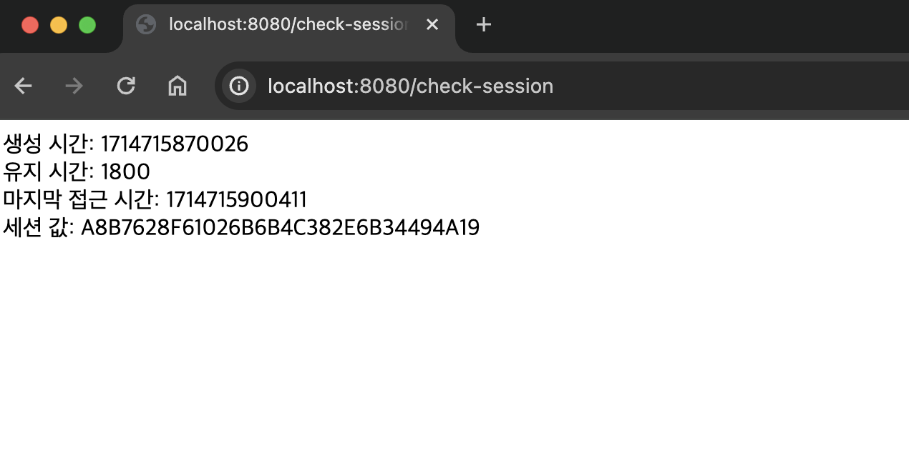
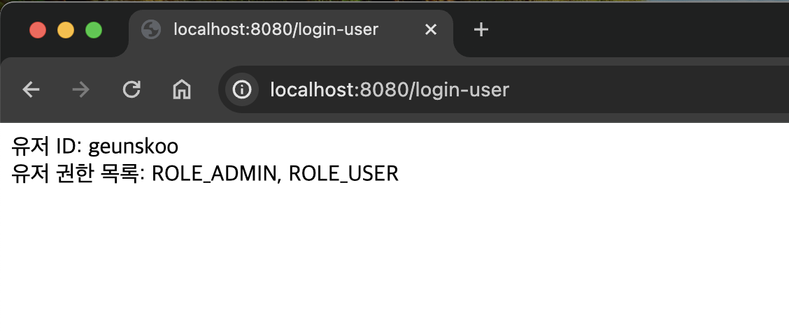
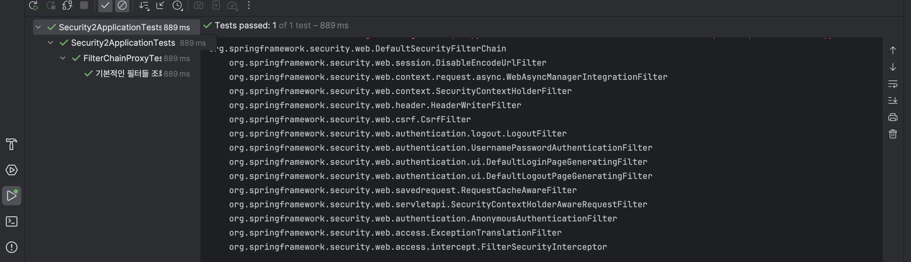

### 1. 배경
---
작년 웹개발 프로젝트에서 Spring Security를 도입한 적이 있다. 당시에는 타이트한 시간내에 기술도입이 필요하였기에 개념적 비약한 부분도 있었다. 그래서 이번 기회를 통해서 스프링 시큐리티에 대해 더 자세히 파헤쳐보고자 한다.

Spring Security를 도입하게 되면 주로 jwt와 함께 적용된 예제코드들이 많이 검색된다.  
나는 <u>아주 간략하게 Spring Security를 적용하고</u> 해당 프레임워크의 라이프사이클과 기능에 대해서 더 집중적으로 알아보겠다.

<br/>
<br/>

### 2. <span style="color: #289e8e">Spring Security</span>에 대해

공식문서에서 정의를 살펴보도록 하자. <a href="https://docs.spring.io/spring-security/reference/index.html" class="href-md">여기</a>   

#### 2.1. 정의

> `Spring Security`  
> "Spring Security is a framework that provides authentication, authorization, and protection against common attacks."  
> "스프링 시큐리티는 인증, 권한 부여 및 일반적인 공격으로부터 보호를 제공하는 프레임워크이다."  

처음에는 스프링 시큐리티는 라이브러리인줄 알았으나, 자신들이 세워둔 구조의 가이드아래에 사용자가 원하는 동작을 작성하면 제어권을 가지고 동작을하는 프레임워크였다.

<br/>

#### 2.2. 설정
스프링 시큐리티 프레임워크를 build.gradle의 dependencies에 등록만해도 스프링부트가 똑똑하게 즉시 동작시킨다.
```gradle:title=build.gradle
dependencies {
    implementation 'org.springframework.boot:spring-boot-starter-security'
}
```

<br/>

만약에, 스프링 시큐리티가 의존성 설정하자마자 즉시 동작하는 것을 원치 않는다면 application.yml에 아래의 값을 세팅하면 된다.
자동구성 설정에서 제외를 시켜서 스프링부트가 SecurityAutoConfiguration 빈으로 등록하지 못하게 하는 것이다.
```yaml:title=application.yml
spring:
  autoconfigure:
    exclude: org.springframework.boot.autoconfigure.security.servlet.SecurityAutoConfiguration
```

그렇다면 스프링 시큐리티가 동작하는 구조와 시점에 대해서 알아보도록하자.

<br/>

#### 2.3. 구조
스프링 시큐리티를 동작시키면 아래의 <span style="color: #289e8e">●</span> 표시된 부분이 요청처리 순서에서 추가된다.

1. 클라이언트 요청
2. `보안 필터 체인`: 스프링 시큐리티가 제공하는 다양한 필터들이 요청을 처리함
    * `인증 필터`: 사용자의 인증 정보를 검증함 (ex. 사용자 이름과 비밀번호)
    * `권한 필터`: 사용자의 권한을 확인하여 요청된 리소스에 대한 접근을 허용할지 결정함
3. 기타 보안 검사: CSRF 보호, 세션 관리 등 추가적인 보안 조치를 수행할 수 있음
4. 디스패처 서블릿
5. 컨트롤러 매핑
6. 컨트롤러 처리
7. 응답 반환

스프링 시큐리티 프레임워크가 동작하면 아래의 그림과 같이 기존의 Servlet 필터를 거치는 중 Delgating Filter Proxy의 구현체로서
우리가 설정하는 Security Filter Chain 필터를 중간에 끼워 넣을 수가 있게 된다. 



<center>[ Spring Security 구조 ]</center>

<br/>
<br/>

### 3. <span style="color: #289e8e">Spring Security</span> 심플한 적용

운동할 때도 고립운동이 중요하다고 하지 않던가?  
스프링 시큐리티를 적용시킬때도 요즘 인기있는 jwt, oauth를 배제한체 오로지 Spring Security를 간단히 적용만 한체 어떤 것들이 있는지 학습을 해보려고 한다.

#### 3.1. 심플한 초기 설정
위의 그림에서 확인했다시피 SecurityFilterChain이 Filter사이에 아무런 설정을 안하면 자동구성에 의해서 기본설정으로 들어가있다고 생각하면된다. 우리는 이제 그 자동구성된 SecurityFilterChain을 우리 입맛대로 바꿔주면된다.  

SecurityFilterChain Interface를 반환하는 Bean을 생성해서 등록해주면 이제 스프링부트가 우리가 원한는 설정에 맞춰서 SecurityFilterChain을 구성할 것이다.

따라서 관례에 맞게 아래와 같이 빈을 등록하자!  
(즉, 위 그림의 <span style="color:red">빨간박스</span>를 설정하는 빈을 등록한다고 생각하면 된다.)

```java:title=SecurityConfig.java
@Configuration
public class SecurityConfig {

    @Bean
    public SecurityFilterChain securityFilterChain(HttpSecurity http) throws Exception {
        http.authorizeHttpRequests((authorize) -> authorize.anyRequest().authenticated()) // 어떤 요청이든 인증을 해라
                .formLogin(Customizer.withDefaults()); // Default 로그인 폼 만들어줘

        return http.build();
    }
}

```
필터를 뚫고 들어오는 요청 HttpSecurity타입 객체를 어떻게 처리해줄지 설정을 해주면된다.  
설정은 Build패턴의 메서드 체이닝방식으로 쉽게 적용이 가능하다.

그리고 서버를 띄우고 localhost:8080을 통해 확인을 해보면 아래의 사진과 같이 로그인폼을 확인 할 수 있다.



<center>[ localhost:8080 ]</center>

<br/>

#### 3.2. 심플한 유저 정보 등록
이제는 로그인 하고자는 유저의 정보를 받아서 인증/인가 하는 과정을 살펴보도록하자!
간단하게 인증/인가에 대해서만 실습할 것임으로 데이터베이스에 저장된 유저의 정보하는 과정을 통해서가 아닌 간단하게 인메모리에 저장된 유저의 정보와 일치하는지 여부로 판단을 해보고자 한다.

```java:title=SecurityConfig.java
@Configuration
public class SecurityConfig {

    @Bean
    public SecurityFilterChain securityFilterChain(HttpSecurity http) throws Exception {
        //위에 코드 참조
    }

    @Bean
    public InMemoryUserDetailsManager userDetailsService(){
        UserDetails user = User.withDefaultPasswordEncoder()
                                .username("geunskoo")
                                .password("1")
                                .roles("USER", "ADMIN")
                                .build();
        return new InMemoryUserDetailsManager(user);
    }
 }
```


<center>[InMemoryUserDetailManager 설명]</center>

<br/>

InMemoryUserDetailManager 객체는 데이터베이스와 같은 저장장치 없이 간단하게 인메모리를 활용한 테스트 목적의 객체이다. 다음과 같이 InMemoryUserDetailManager에 내가 저장하고 싶은 객체를 넣어두면 된다.  

계정은 geunskoo, 비밀번호 1, 권한 유저, 관리자 로 생성했다.

#### 3.3. 심플한 컨트롤러 생성 

그 다음 컨트롤러를 아래와같이 만들었다.
```java:title="TestController.java"
@RestController
public class TestController {

    @GetMapping("/")
    public String index(){
        return "루트로 접근성공";
    }

    @GetMapping("/hello")
    public String hello(){
        return "hello로 접근성공";
    }

    @GetMapping("/check-session")
    public String checkSession(HttpSession session) {
        long creationTime = session.getCreationTime();
        long lastAccessedTime = session.getLastAccessedTime();
        int maxInactiveInterval = session.getMaxInactiveInterval();

        String id = session.getId();
        return "생성 시간: " + creationTime + "<br/>"
                + "유지 시간: " + maxInactiveInterval + "<br/>"
                + "마지막 접근 시간: " + lastAccessedTime + "<br/>"
                + "세션 값: " + id;
    }

    @GetMapping("/login-user")
    public String loginUser(@AuthenticationPrincipal UserDetails userDetails) {
        return "유저 ID: " + userDetails.getUsername() + "<br/>"
                + "유저 권한 목록: " + userDetails.getAuthorities().stream().map(String::valueOf).collect(Collectors.joining(", ")) + "<br/>";
    }
}
```
위의 코드에서 모든 API요청에 대해서 인증을 받을 것을 요구하였음으로 '/', '/hello', '/check-session', '/login-user' 요청 모두 사용자의 인증이 요구된다.


<center>[ 로그인이 완료되면 '/'로 접근이 가능해짐 ]</center>

<br/>

#### 3.3. 분석
Config과 Controller 코드 조금만으로도 인증/인가 시스템을 쉽게 구축할 수 있었다. 각자의 요구사항에 맞게 여기에 코드를 더 붙여가면서 커스텀마이징을 하게 될 것이다. 사실 내가 이글을 작성하는 목적성은 여기있다. 커스텀하기전의 상태에 대해서 잘 알아야 커스텀도 잘 할 수 있다고 생각한다.  
default에 가까운 위의 코드를 분석하며 내가 알게된 것들 정리, 분석해보겠다.

`기본 세팅값을 유지하면 Session방식으로 유저의 상태를 관리를 한다!`  
(해당 값 HttpSession타입으로 파라미터 값으로 받아올 수 있다.)



<center>[ /check-session API을 통해서 출력해본 결과 ]</center>

<br/>
<br/>

`@AuthenticationPrincipal를 이용하면 인증/인가된 유저의 정보를 가져올 수 있다!`  



<center>[ /login-user API을 통해서 출력해본 결과 ]</center>

<br/>

`SpringSecurity 기본적인 필터들은 어떤 것이 있을까?`  

org.springframework.security.web.FilterChainProxy 를 의존성 주입을 받아서 해당 객체안에 어떤 필터들이 있는지  
테스트 코드를 작성해서 알아보도록 하자!

```java:title=SecurityApplicationTests.java
@SpringBootTest
@AutoConfigureMockMvc
class SecurityApplicationTests {

    @Autowired
    private FilterChainProxy filterChainProxy;

    @Nested
    @DisplayName("기본적인 필터들 조회해보기")
    class FilterChainProxyTest {

        @Test
        public void checker(){
            List<SecurityFilterChain> filterChains = filterChainProxy.getFilterChains();
            for (SecurityFilterChain filterChain : filterChains) {
                System.out.println(filterChain.getClass().getName());
                List<Filter> filters = filterChain.getFilters();
                for (Filter filter : filters) {
                    System.out.println("    " + filter.getClass().getName());
                }
            }
        }
    }
}

```


<center>[ 기본적인 필터 목록들 ]</center>

SecurityFiterChain안에 기본적으로 15개 가량의 필터들이 존재하는 것을 확인할 수 있었다. 만약에 내가 커스텀한 필터를 넣어주고 싶으면 OncePerRequestFilter혹은 Filter 인터페이스를 구현하면 된다. 그리고 해당 구현체를 SecurityConfig의 SecurityFilterChain빈의 생성 메서드에 .addFilter~ 로 시작하는 메서드로 체이닝 시켜주면된다.

<br/>
<br/>

### 4. 결론
---
처음 스프링 시큐리티를 적용하고 사용해야했을 때는 시간적인 제약도 있었고, jwt + spring security 등 이미 요구사항게 맞게 많이 커스텀된 상태의 다른 분들의 예시를 보면서 접근했었다. 적용은 성공적으로 끝났지만 유지보수를 해야할 때, 내손을 벗어난 느낌이 있을 것 같아서 정리하는 시간을 가져보았다.  
확실히 라이브러리나 프레임워크를 공부할 때, 그것을 만든이가 초창기 혹은 기본값을 설정한 것들에 대해 이해하는 시간을 가지면 그것들을 더 잘 다루고 응용할 수 있게 되는 것 같다. 

긴글 읽어주셔서 감사합니다.  
오류나 문제가 있다면 댓글 부탁드립니다!!

<br/>
<br/>

### 참고
---
* [docs.spring.io/spring-security](https://docs.spring.io/spring-security/reference/index.html)

<br/>
<br/>