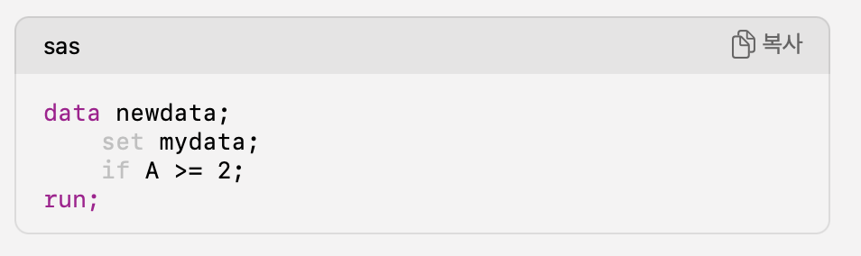
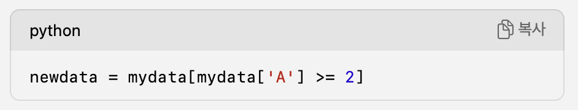
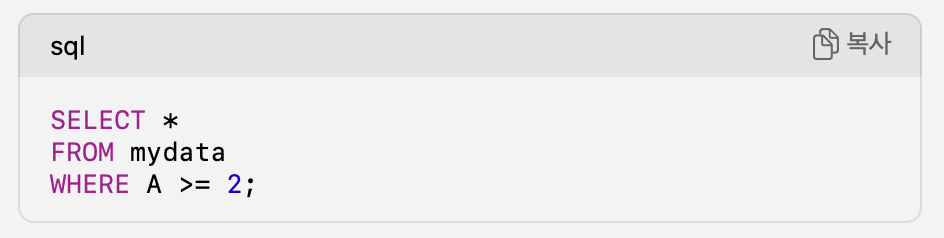

### 1. 책을 읽게 된 계기
---
나는 그 동안 ORM(JPA)를 이용해서 서버에서 데이터를 접근하는 기술을 즐겨서 사용했다. 하지만 회사에서는 Mybatis와 오라클DB를 이용해서 데이터를 조회하고 있었고, 비즈니스로직을 SQL로 풀어내는 것이 팀 규칙이었다. 따라서 오라클 기반 SQL을 연습할 필요성이 있었다. 코드에 비즈니스로직이 약간 담겨있었기에 최적화를 생각을 하면서 쿼리문을 작성해야 했다. 당장 중급이상의 실력을 내고 싶지만, 한번에 실력을 팬텀점프 할 수 없기에 그 사이를 연결하는 다리 역할을 해줄 책이 필요했다.  

이 책은 세부적인 코드수준의 개념에 deep dive하기전에, 성능/최적화/인덱스/실행계획이라는 키워드를 중심으로 개념을 확장해주었다. 이것은 내가 원하는 부분과 정확히 일치했기에 시원한 효자손 역할을 해줄 것이라 기대하고 선정하였다.

 

### 2. 책을 읽고 나서
---
책에서 내가 궁금한 점을 저자가 정확히 짚어서 설명을 해주면 소름이 끼치도록 시원한 느낌이 든다. 해당 책은 매우 시원했다. 최적화에 대한 부분은 어깨 넘어로 들은 내용이 머릿속에서 정리된 느낌이었는데, 반복계/포장계에 대한 부분은 내가 정말 궁금했던? 아니 찝찝했던(느낌만 있었지 정확한 인지는 못하고 있었으니)부분을 아주 잘 설명해주고 있었다.  

사실 그부분이 왜 그렇게 궁금했는지...tmi를 풀어보겠다.  
여자친구가 SAS라는 언어를 통해서 의료보건데이터분석을 하고 있는데, 아직은 나보다는 상대적으로 코린이라서 나에게 질문을 많이한다. SAS에서도 PROC이라는 키워드로 SQL을 이용해서 데이터에 엑세스를 할 수 있었고, DATA STEP절에서 데이터를 가공하는 것이 가능하다. 연구하는 도메인 특성상 데이터 그룹내에서 레코드 간의 성질을 이용해서 데이터를 처리하는 일이 많았다. 다량의 데이터를 분석하고 다루기에 혹시 SAS, DATA STEP 그리고 SQL도 파이썬의 판다스/넘파이와 같이 벡터라이즈 연산을 지원하지 않을까 ? 라는 의문이 생겼고, 그럴 것이다라는 약간의 확신이 있었는지도 모르겠다.

[SAS를 이용한 특정 행(레코드) 제거]

 

[Pandas를 이용한 특정 행(레코드) 제거]

 

[SQL을 이용한 특정 행(레코드) 제거]

 

뭔가 셋 다 백터라이즈연산을 통해서 레코드별로 데이터를 처리하는 것 같지 않은가? '망치를 들고 있는 사람 눈에는 모든 문제가 못으로 보인다' 라는 말이 딱 맞는 상황이었다. 파이썬 판다스에 조금 더 익숙해져 있는 시점에서는 서로 다른 언어들은 다른 패러다임을 가지고 있지만 전부다 "벡터라이즈연산과 같은 논리로 움직이겠네?" 라고 약간의 찝찝함을 무시해버린 채 속단을 해버렸다.  

책에서는 포장계/반복계 라는 개념을 시작으로 SQL언어의 프로그래밍 패러다임인 선언형프로그래밍에 대해서 설명했다. 이를 통해 SQL/판다스/SAS 모두 다른 사고로 접근해야한다는 것을 알게되었다. 한쪽 프로그래밍 패러다임으로 접근하면 망치라는 하나의 도구만 들고 모든 문제를 바라보는 것이었다. 우리가 SQL을 작성할 때 유독 서브쿼리 사용해서 풀어내는 것이 윈도우함수를 사용하는 것보다 쉽게 느껴지는 이유는 우리가 절자지향언어에 익숙해져있고, 사고의 흐름이 거기에 맞춰져있었기 때문이다. 즉, SQL을 작성할 때는 집합간의 관계에 집중해서 집합적 관점으로 문제를 거시적으로 바라보아야(레코드에 집중하지 않는) 코딩이 쉬웠던 것이었다.

c, c++, java, python, js, html... 등등 다양한 언어들을 배우면 항상 이 언어는 ~~~ 패러다임을 가진언어야 라고 소개를 먼저시작을 하는데, 그러한 패러다임의 중요성을 이 책을 읽으면서 알게된 것 같다. 개념이 많이 확장된 시점에서는 다시한번은 본질을 되짚어보는 것이 중요하겠다는 경험을 할 수 있었다. 사실 이 책에서 말하고자는 핵심은 이런 것들이 아닐테지만 내가 책을 보면서 느낀 울림을 집중해서 쓰다보니 이런 감상이 완성되었다...

 

### 3. 총평
---
SQL초급에서 중급으로 점프하고 싶을 때, 징검다리가 되어주는 소중한 책이었다. 그리고 나처럼 예상치 못한 곳에서 진한 울림을 느낄 수 있을지 모르니 정말 모두에게 강추하고 싶은 책이다.